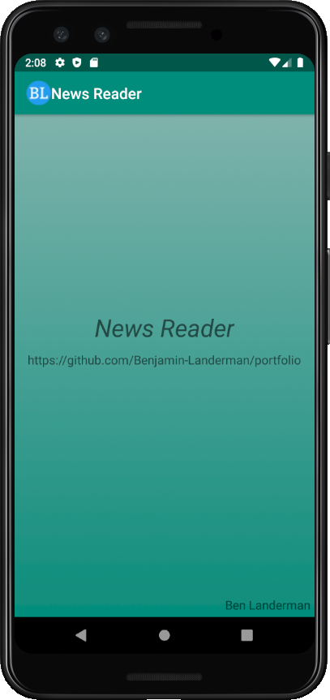
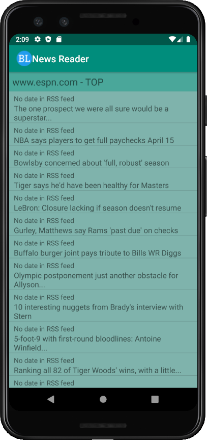
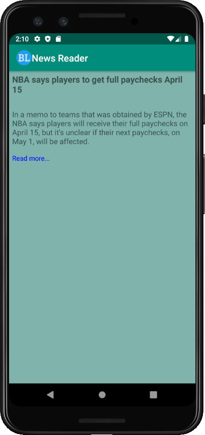
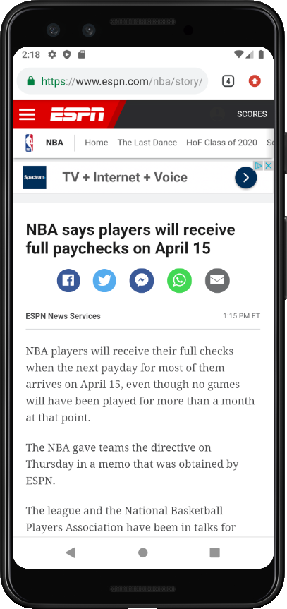
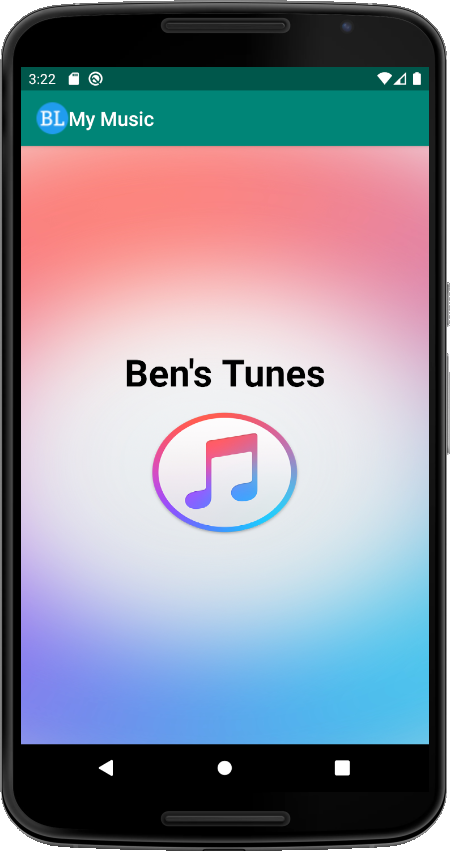
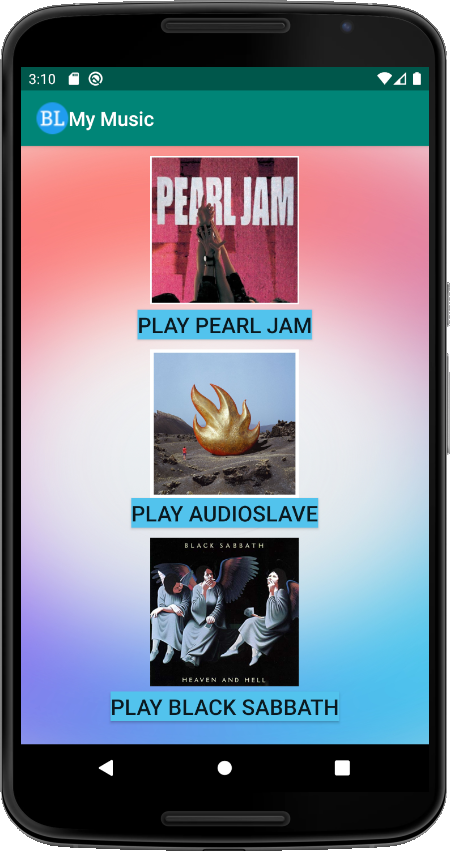
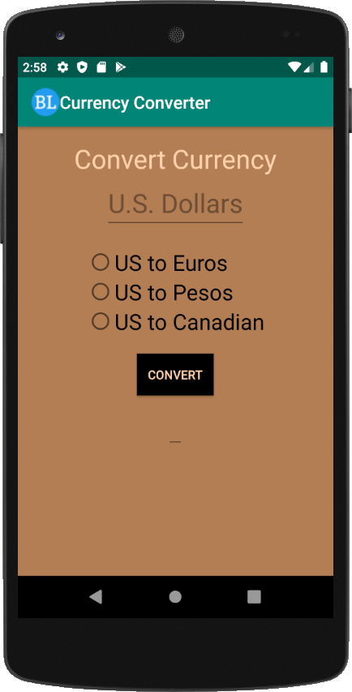
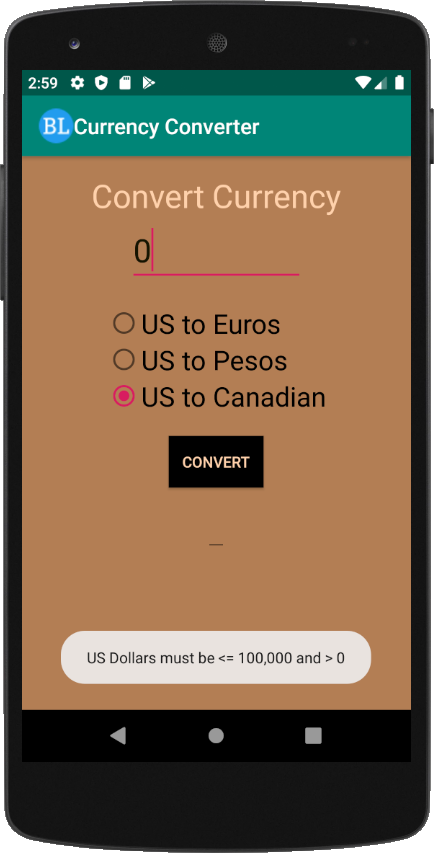
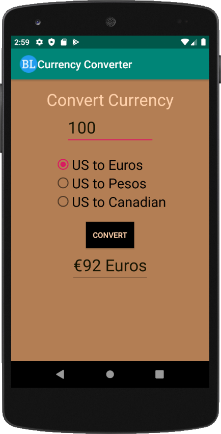

# Benjamin Landerman's Portfolio

## Mobile Apps README

### Sample of Mobile Apps Developed Through Android Studio Code

#### Screenshots of Android Apps:

*RSS Feed*

- Android app that displays a RSS Feed allowing users to view a short preview of an article with a link to the full article

| *Screenshot of splash screen*                 | *Screenshot of main screen*                   | *Screenshot of selection*                     | *Screenshot of article*                       |
|:---------------------------------------------:|:---------------------------------------------:|:---------------------------------------------:|:---------------------------------------------:|
|                        |                          |                     |                       |

*Media Player*

- Android app that plays music based on user selection

| *Screenshot of splash screen*                 | *Screenshot of main screen*                   | *Screenshot of currently playing screen*      |
|:---------------------------------------------:|:---------------------------------------------:|:---------------------------------------------:|
|                         |                           |                        |

*Currency Conversion*

- Android app that converts U.S. dollars to Euros, Pesos, or Canadian Dollars based on user selection

| *Screenshot of unpopulated user interface*    | *Screenshot of toast notification*            | *Screenshot of converted currency*            |
|:---------------------------------------------:|:---------------------------------------------:|:---------------------------------------------:|
|                          |                      |                 |