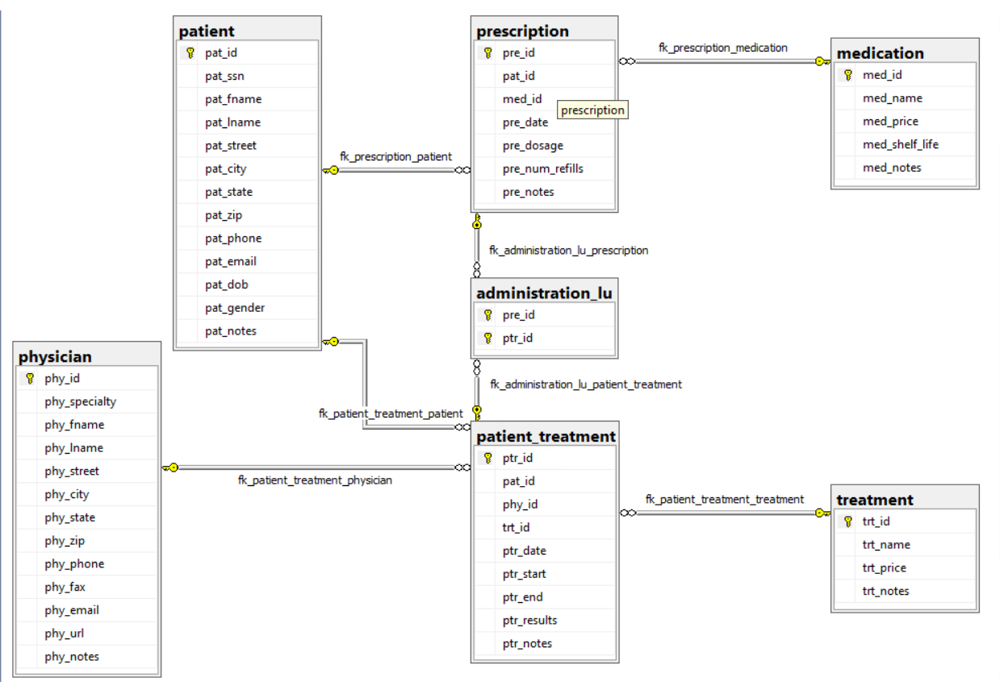

# Benjamin Landerman's Portfolio

## MS SQL README

### Sample of Microsoft SQL Server Work

*Links to Code:*
- [Office Supply Database](office_supply_database.sql "Office Supply Database")
- [Office Supply Queries](office_supply_queries.sql "Office Supply Queries")
- [Rental Database](rental_database.sql "Rental Database")
- [Rental Queries](rental_queries.sql "Rental Queries")
- [Hospital Database](hospital_database.sql "Hospital Database")
- [Hospital Queries](hospital_queries.sql "Hospital Queries")

#### Screenshots of ERDs:

| *Office Supply Database ERD*                  | *Rental Database ERD*                         |
|:---------------------------------------------:|:---------------------------------------------:|
|       |              |

| *Hospital Database ERD*                       |
|:---------------------------------------------:|
|          |