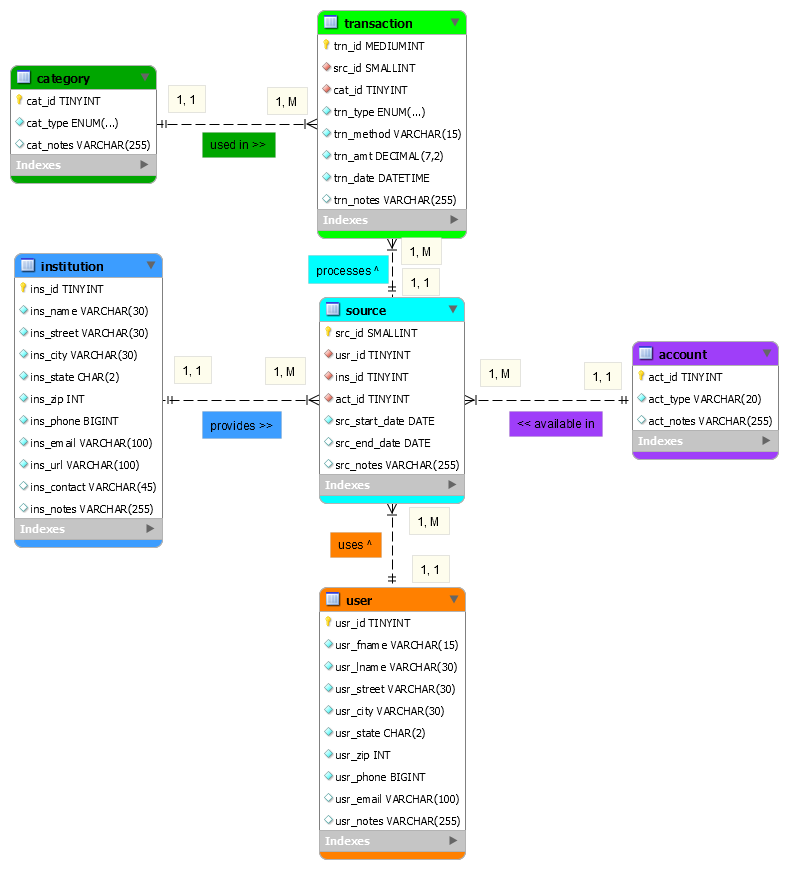
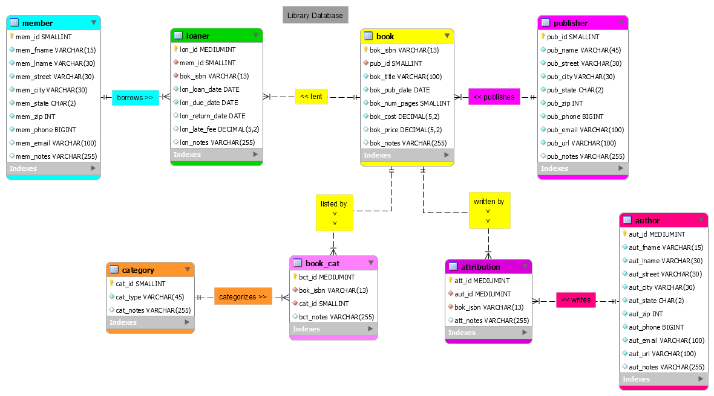

# Benjamin Landerman's Portfolio

## MySQL README

### Sample of MySQL Work

*Links to Code:*
- [Court Database](court_database.sql "Court Database")
- [Court Queries](court_queries.sql "Court Queries")
- [Finance Database](finance_database.sql "Finance Database")
- [Finance Queries](finance_queries.sql "Finance Queries")
- [Bank Database](bank_database.sql "Bank Database")
- [Bank Queries](bank_queries.sql "Bank Queries")
- [Library Database](library_database.sql "Library Database")
- [Library Queries](library_queries.sql "Library Queries")

#### Screenshots of ERDs:

| *Court Database ERD*                          | *Bank Database ERD*                           |
|:---------------------------------------------:|:---------------------------------------------:|
|                |                  |

| *Library Database ERD*                        |
|:---------------------------------------------:|
|            |