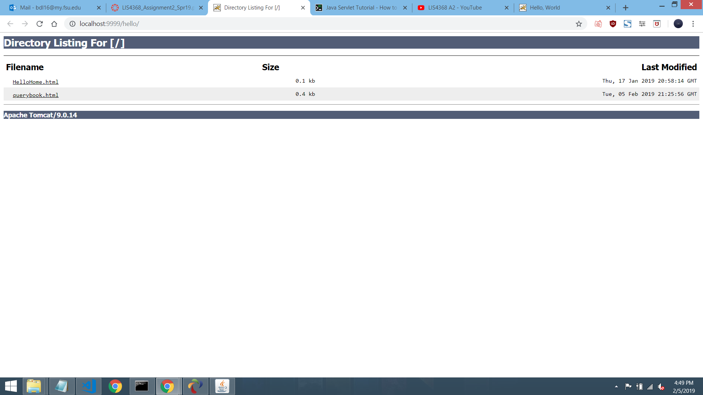
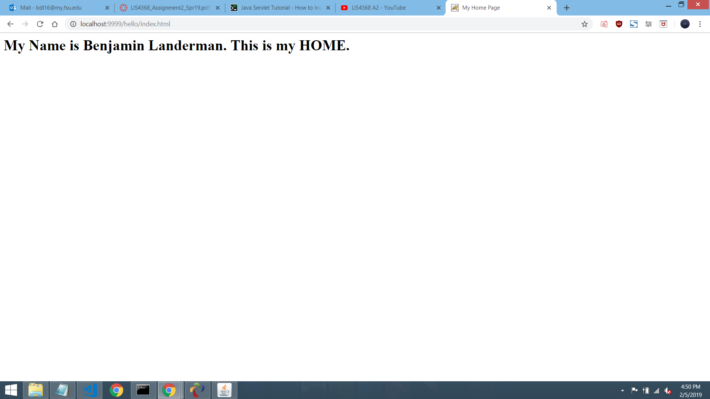
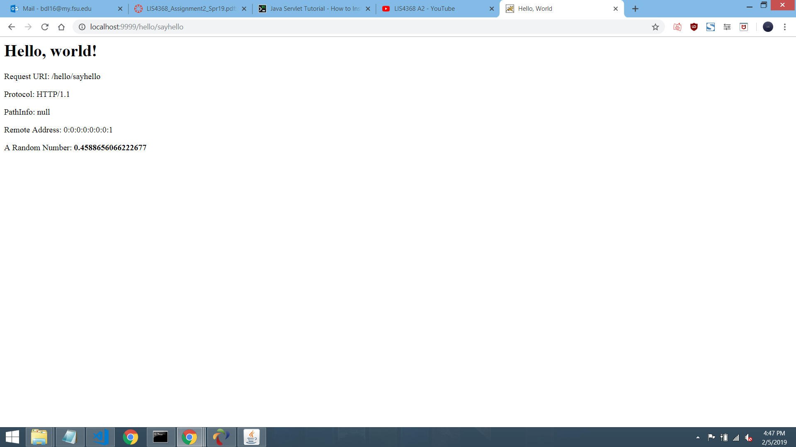
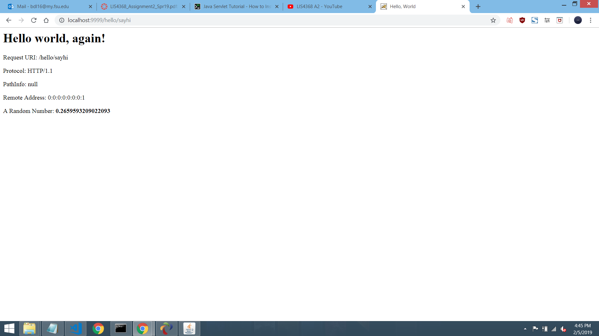
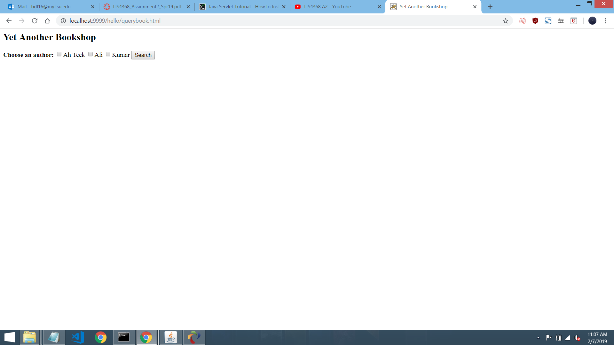
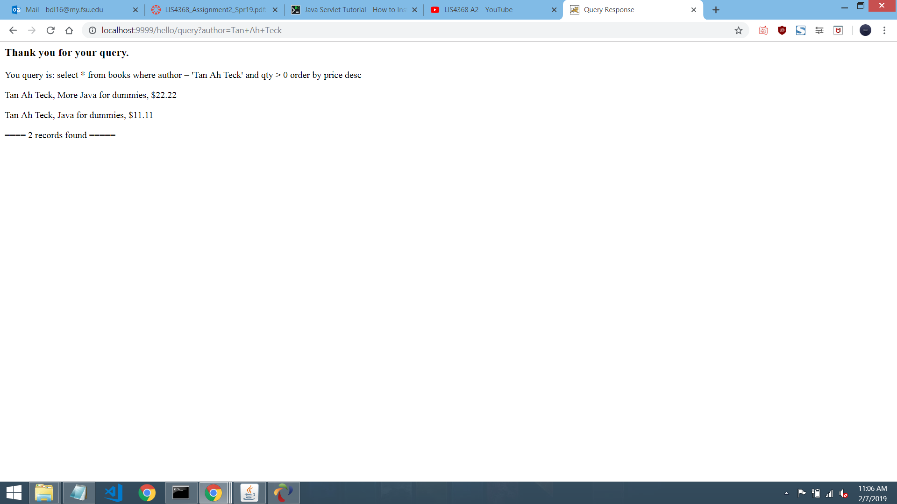

# LIS4368 Advanced Web Applications

## Benjamin Landerman

### Assignment 2 Requirements:

*Assignment Requirements:*

1. Development Installations
2. Questions

#### README.md file should include the following items:

* Assessment Links
* Screenshot of query results

#### Assessment Links:

1. [localhost:9999/hello](http://localhost:9999/hello "localhost:9999/hello")
2. [localhost:9999/HelloHome](http://localhost:9999/hello/HelloHome.html "localhost:9999/hello/HelloHome")
3. [localhost:9999/hello/sayhello](http://localhost:9999/hello/sayhello "localhost:9999/hello/sayhello")
4. [localhost:9999/hello/querybook](http://localhost:9999/hello/querybook.html "localhost:9999/hello/querybooke")
5. [localhost:9999/hello/sayhi](http://localhost:9999/hello/sayhi "localhost:9999/hello/sayhi")

#### Assignment Screenshots:

| *Screenshot of running index.html*            | *Screenshot of running localhost:9999/Hello*  |
|:---------------------------------------------:|:---------------------------------------------:|
|                |                        |

| *Screenshot of running Hello World*           | *Screenshot of running Hello World Again*     |
|:---------------------------------------------:|:---------------------------------------------:|
|                 |                       |

| *Screenshot of running query*                 | *Screenshot of the query running*             |
|:---------------------------------------------:|:---------------------------------------------:|
|                |          |
