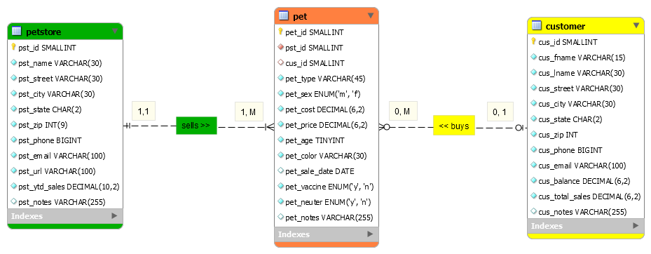

> **NOTE:** This README.md file should be placed at the **root of each of your repos directories.**
>
>Also, this file **must** use Markdown syntax, and provide project documentation as per below--otherwise, points **will** be deducted.
>

# LIS4368 Advanced Web Applications

## Benjamin Landerman

### Assignment 3 Requirements:

*Deliverables:*

1. Entity Relationship Diagram (ERD)
2. Include data (at least 10 records each table)
3. Provide Bitbucket read-only access to lis4368 repo, must include README.md using Markdown Syntax, and include links to all of the following files (from README.md):
    - docs folder: a3.mwb and a3.sql
    - img folder: a3.png (export a3.mwb file as a3.png)
    - README.md (MUST display a3.png ERD)
4. Blackboard Links: Bitbucket repo

#### README.md file should include the following items:

* Screenshot of ERD that links to the image
* Links to A3 MWB and SQL Files

#### Assignment Screenshots Links:

*[Screenshot of A3 ERD](img/a3.png "A3 img")*:

*A3 Docs: a3.mwb and a3.sql*

[A3 MWB File](docs/a3.mwb "Link to A3 MWB")

[A3 SQL File](docs/a3.sql "Link to A3 SQL")