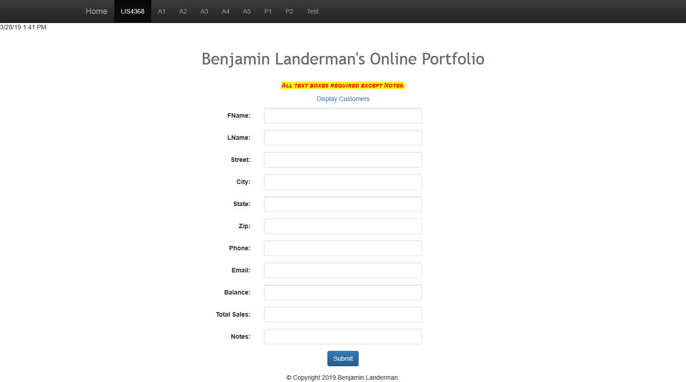
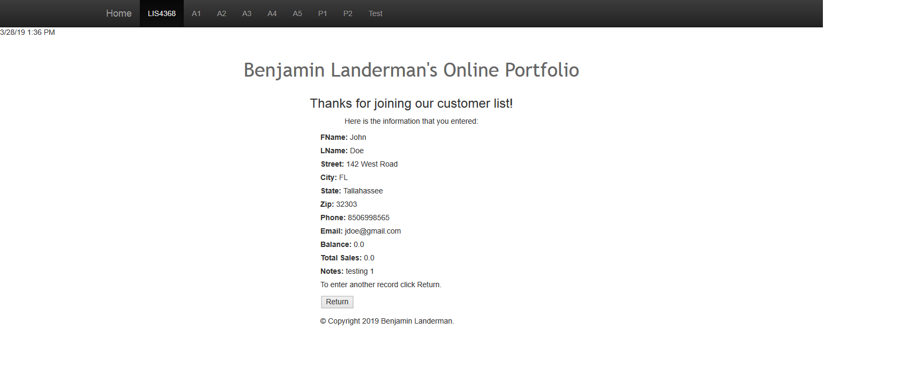

# LIS4368 Advanced Web Applications

## Benjamin Landerman

### Assignment 4 Requirements:

*Deliverables:*

1. Basic [server-side validation](http://localhost:9999/lis4368/customerform.jsp?assign_num=a4 "Link to server-side validation") for Customer

#### README.md file should include the following items:

* Screenshot of Failed Validation
* Screenshot of Passed Validation

#### Assignment Screenshots Links:

| *Screenshot of Failed Validation*             | *Screenshot of Passed Validation*             |
|:---------------------------------------------:|:---------------------------------------------:|
|||