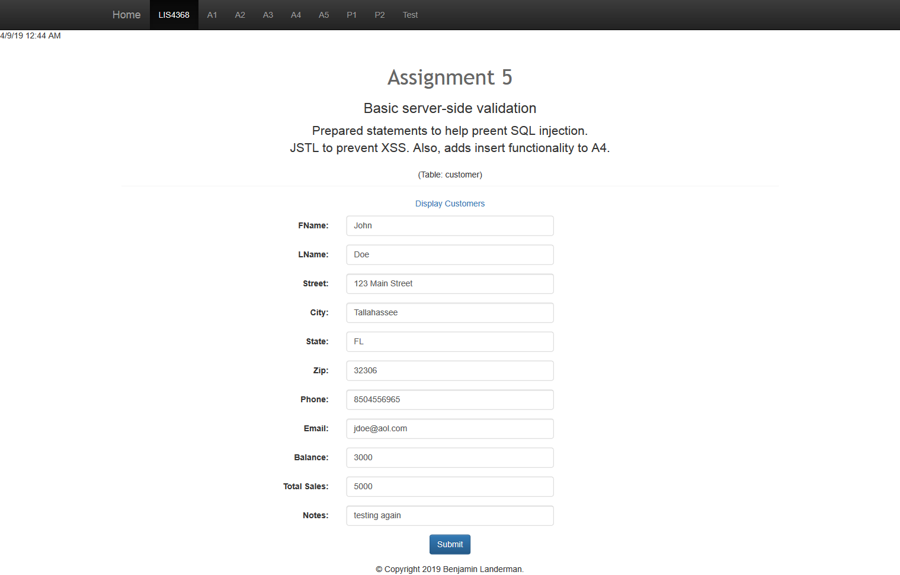
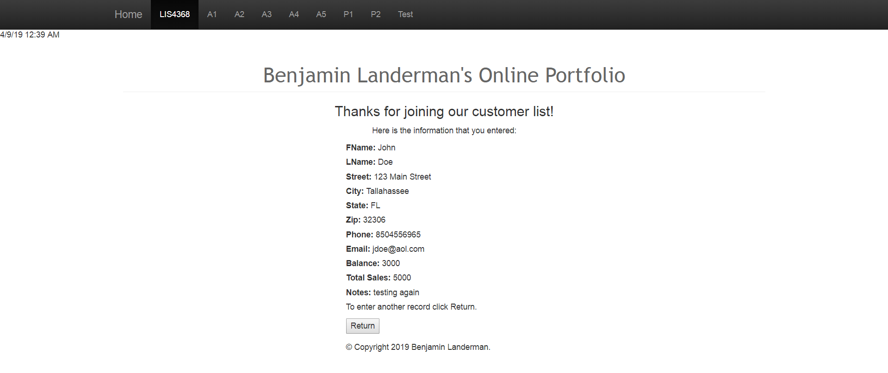
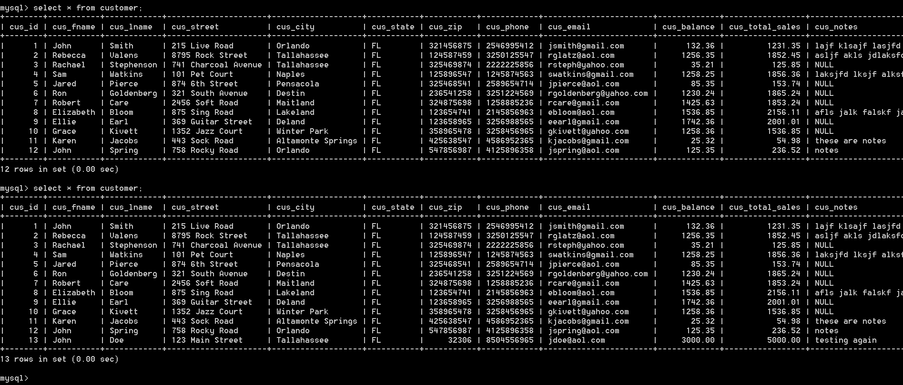

> **NOTE:** This README.md file should be placed at the **root of each of your repos directories.**
>
>Also, this file **must** use Markdown syntax, and provide project documentation as per below--otherwise, points **will** be deducted.
>

# LIS4368 Advanced Web Applications

## Benjamin Landerman

### Assignment 5 Requirements:

*Deliverables:*

1. Basic [server-side validation](http://localhost:9999/lis4368/customerform.jsp?assign_num=a5 "Link to server-side validation") for Customer
2. Prepared statements to prevent SQL Injection
3. JSTL to prevent XSS
4. Insert functionality

#### README.md file should include the following items:

* Screenshot of Valid User Entry Form
* Screenshot of Passed Validation
* Screenshot of Database Entry

#### Assignment Screenshots Links:

| *Screenshot of Valid User Entry Form*             | *Screenshot of Passed Validation*             |
|:---------------------------------------------:    |:---------------------------------------------:|
|                  |           |

| *Screenshot of Associated Database Entry*         |
|:---------------------------------------------:    |
|                    |