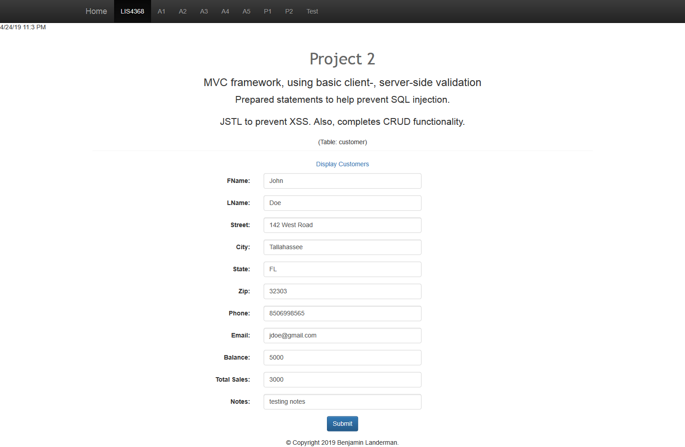
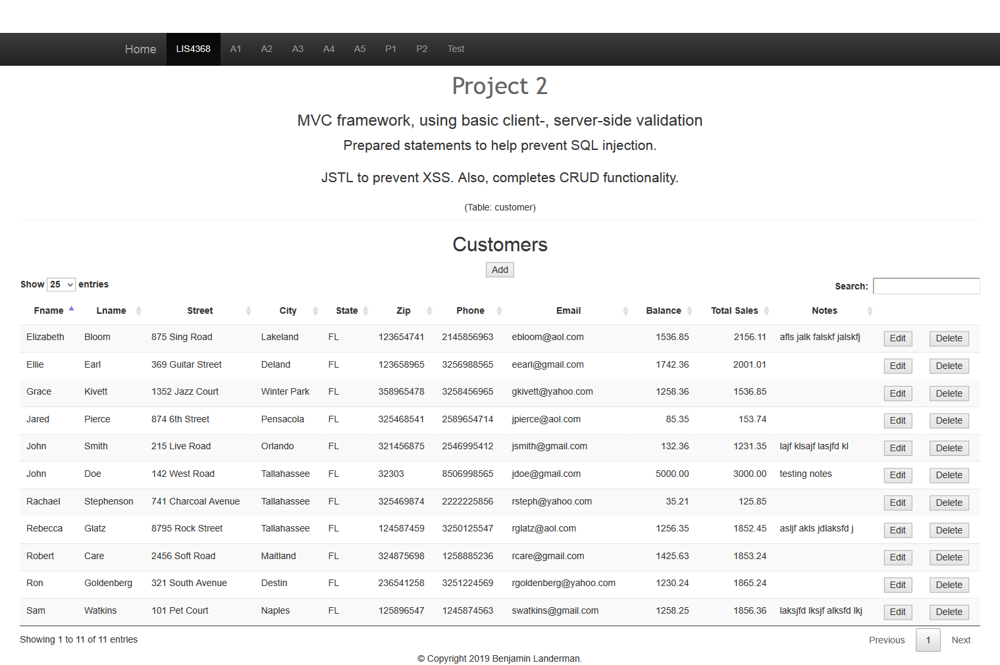
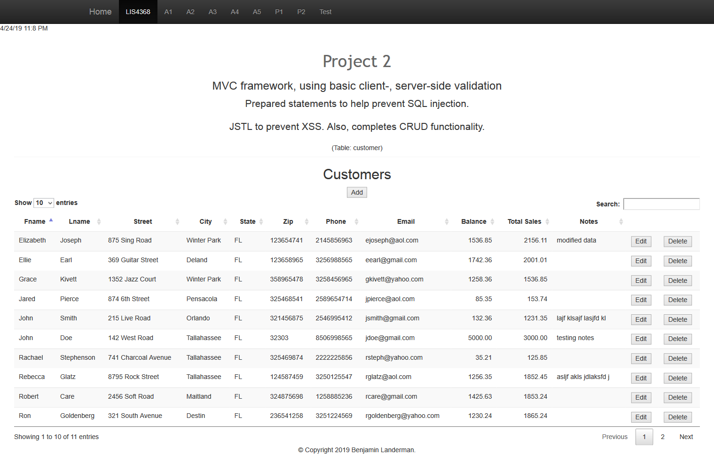
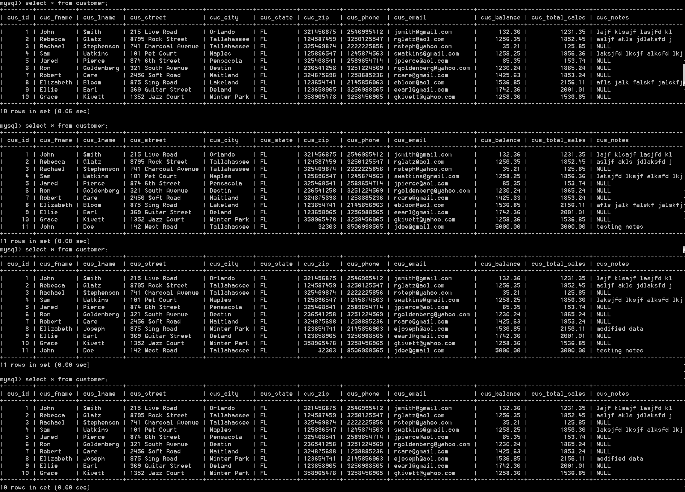

# LIS4368 Advanced Web Applications

## Benjamin Landerman

### Final Screenshots:

#### Requirements:

* Screenshot of Valid User Entry Form
* Screenshot of Passed Validation
* Screenshot of Data Displayed
* Screenshot of Modify Form
* Screenshot of Modified Data
* Screenshot of Delete Warning
* Screenshot of Database Changes

####  Screenshots:

| *Screenshot of Valid User Entry Form*             | *Screenshot of Passed Validation*             |
|:---------------------------------------------:    |:---------------------------------------------:|
|                       |           |

| *Screenshot of Displayed Data*                    | *Screenshot of Modified Form*                 |
|:---------------------------------------------:    |:---------------------------------------------:|
|                    |         |

| *Screenshot of Modified Data*                     | *Screenshot of Delete Warning*                |
|:---------------------------------------------:    |:---------------------------------------------:|
|           |          |

| *Screenshot of Associated Database Changes*       |
|:---------------------------------------------:    |
|                   |