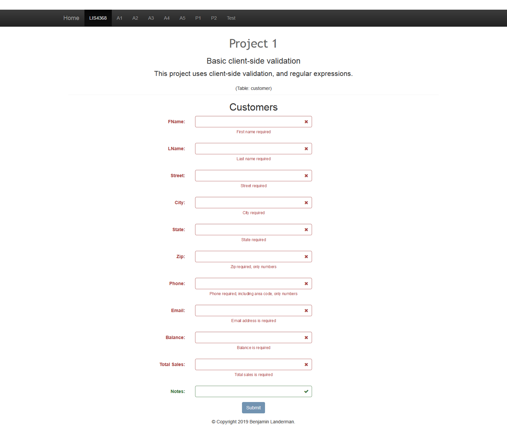
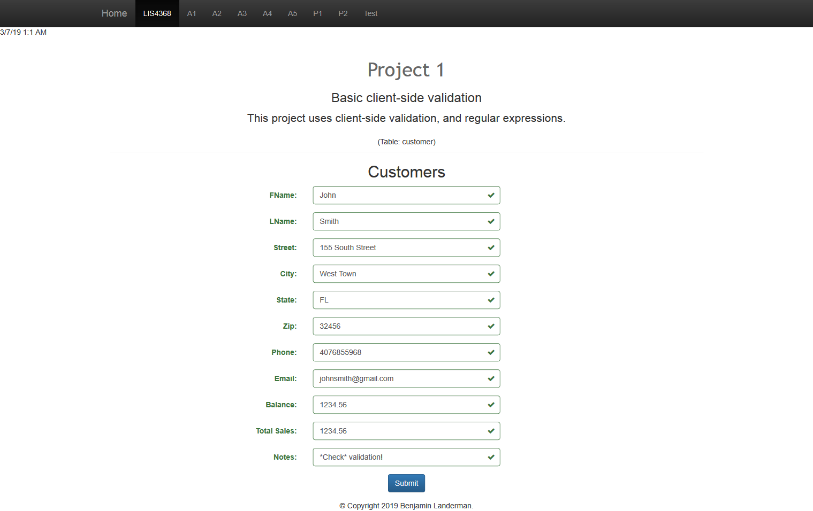

> **NOTE:** This README.md file should be placed at the **root of each of your repos directories.**
>
>Also, this file **must** use Markdown syntax, and provide project documentation as per below--otherwise, points **will** be deducted.
>

# LIS4368 Advanced Web Applications

## Benjamin Landerman

### Project 1 Requirements:

*Deliverables:*

1. Basic [client-side validation](http://localhost:9999/lis4368/p1/index.jsp "Link to client-side validation") for Customer
2. Carousel contains three slides with text and images that link to other content areas.

#### README.md file should include the following items:

* Screenshot of failed validation
* Screenshot of passed validation

#### Assignment Screenshots Links:

| *Screenshot of Failed Validation*             | *Screenshot of Passed Validation*             |
|:---------------------------------------------:|:---------------------------------------------:|
|||