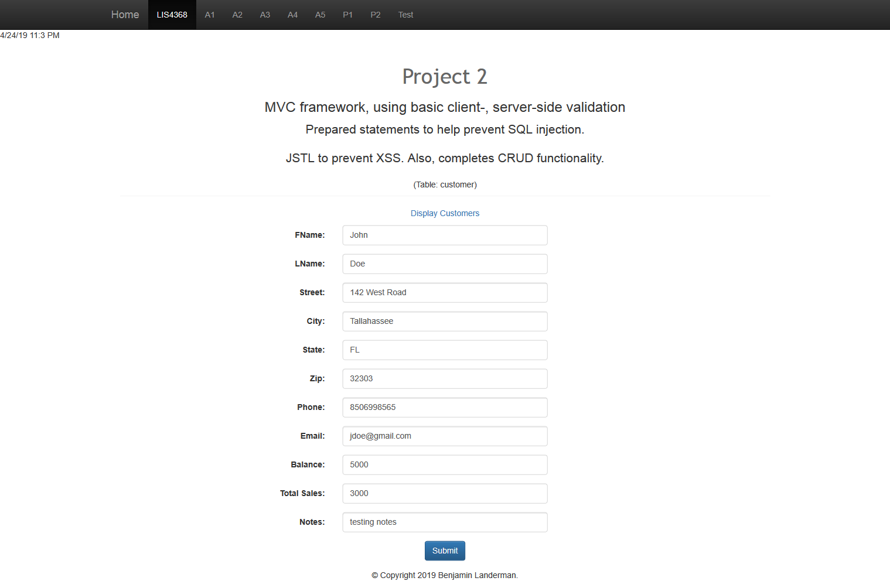
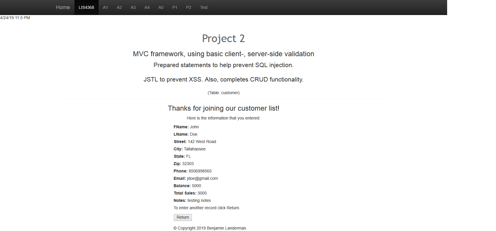
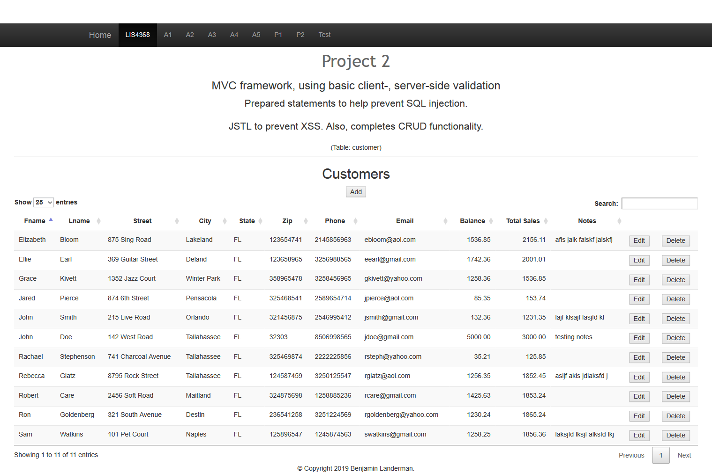
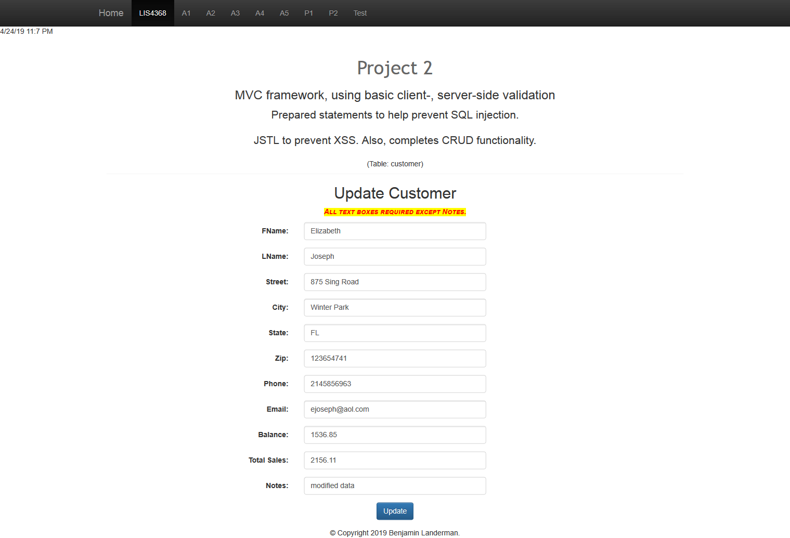
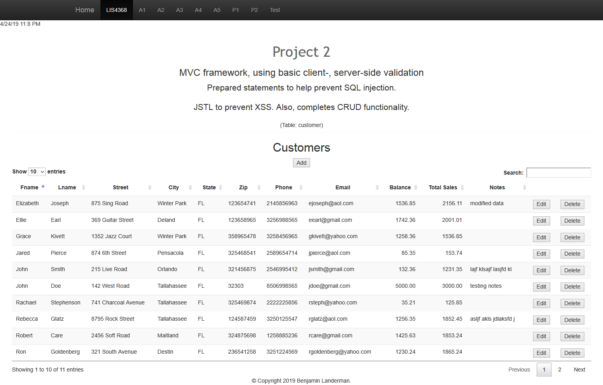
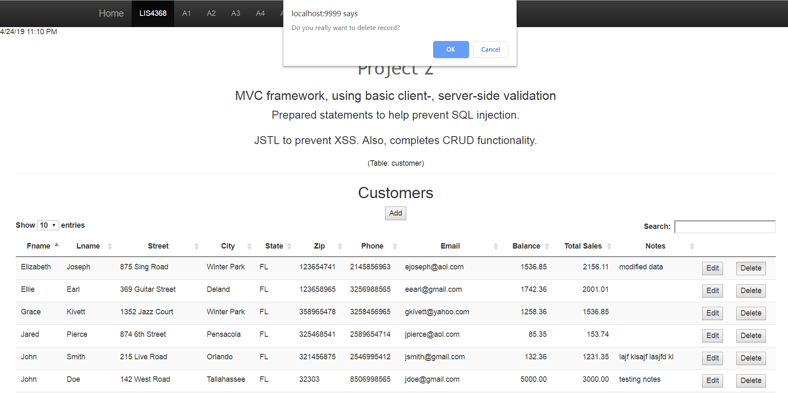
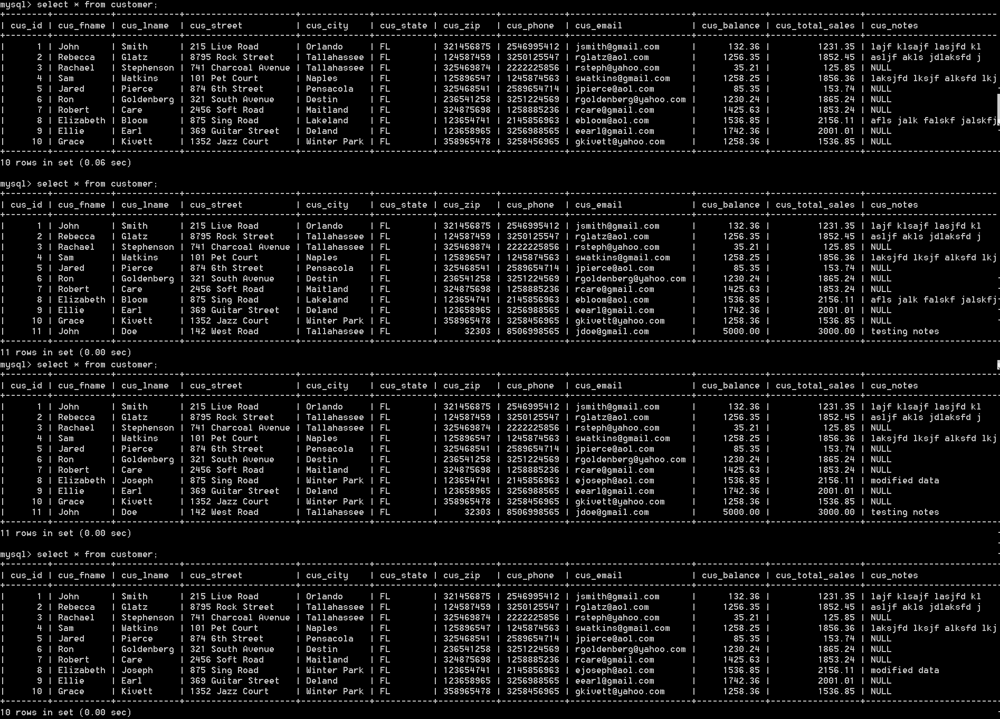

> **NOTE:** This README.md file should be placed at the **root of each of your repos directories.**
>
>Also, this file **must** use Markdown syntax, and provide project documentation as per below--otherwise, points **will** be deducted.
>

# LIS4368 Advanced Web Applications

## Benjamin Landerman

### Project 2 Requirements:

*Deliverables:*

1. Complete application using the MVC framework and provide CRUD functionality
2. Client and server-side validation
3. JSTL to prevent XSS
4. Prepared statements to prevent SQL injection

#### README.md file should include the following items:

* Screenshot of Valid User Entry Form
* Screenshot of Passed Validation
* Screenshot of Data Displayed
* Screenshot of Modify Form
* Screenshot of Modified Data
* Screenshot of Delete Warning
* Screenshot of Database Changes

#### Assignment Screenshots Links:

| *Screenshot of Valid User Entry Form*             | *Screenshot of Passed Validation*             |
|:---------------------------------------------:    |:---------------------------------------------:|
|                       |           |

| *Screenshot of Displayed Data*                    | *Screenshot of Modified Form*                 |
|:---------------------------------------------:    |:---------------------------------------------:|
|                    |         |

| *Screenshot of Modified Data*                     | *Screenshot of Delete Warning*                |
|:---------------------------------------------:    |:---------------------------------------------:|
|           |          |

| *Screenshot of Associated Database Changes*       |
|:---------------------------------------------:    |
|                   |